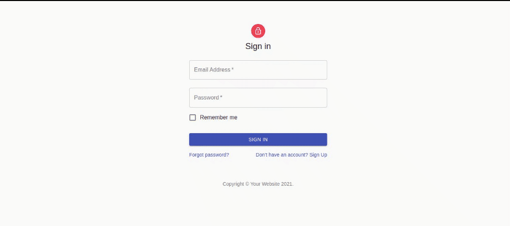
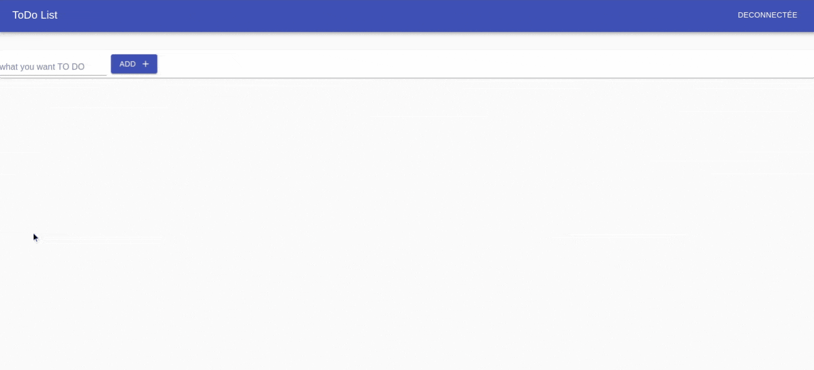

# React Hooks Application de liste Todo
> une application List TODO simple utilisant ** React Hooks,  ** et ** Material-UI **

## Prérequis
- un IDE comme Visual Studio Code ;

- Node ;

- npm 5.3+ ;

## Installer
Fist, clonez le repo   dans votre local. Entrez dans le dossier de  projet et exécutez
`` sh
npm installer

## Run 

```sh
npm start
```

## Preview
   ## Login
   


  ## Add Todo


## Edit Todo


## Edit Todo

